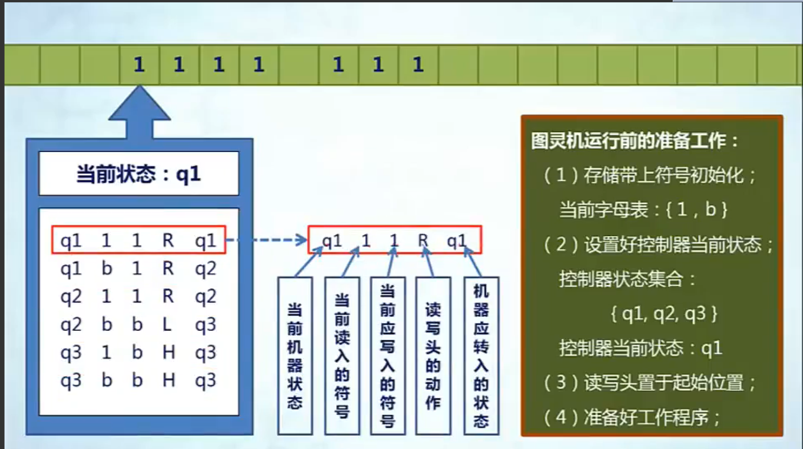
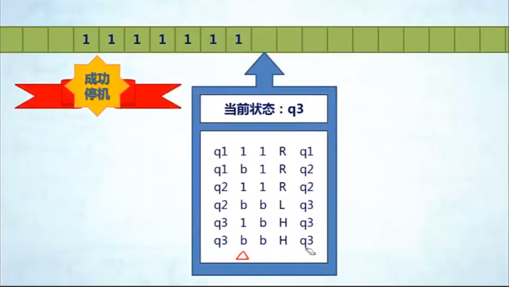

# Week1

## 课程结构

计算导论

- 计算机的基本原理
- 计算机的发展趋势
- 程序运行的基本原理

C程序设计

- 感性认识C程序
- 理性认识C程序
- 结构化的程序——函数
- 更多的数据结构

## 计算机的基本原理

三大数学危机

- 一切数均可表成整数或整数之比（引入无理数）
- 微积分的无穷小（引入极限与实数理论）
- 集合论的罗素悖论（哥德尔不完备性定理，说明数学彻底形式化是不可能的）

可计算问题

- 定义：设函数f的定义域是D，值域是R，如果存在一种算法，对D中任意给定的x，都能计算出f(x)的值，则称函数f是可计算的
- 研究思路：为计算建立一个数学模型，然后证明，凡是这个计算模型能够完成的任务，就是可计算的任务

## 图灵机的基本构成

### 图灵机的构成

- 一条存储带
  - 双向无限延长
  - 上有一个个小方格
  - 每个小方格存储一个数字/字母
- 一个控制器
  - 包含一个读写头
  - 可以接受设定好的程序语句
  - 可以存储当前自身的状态
  - 可以变换自身的状态
  - 可以沿存储带移动

### 运作机理

1. 准备
   1. 存储带上符号初始化
   2. 控制器设置好自身当前状态
   3. 控制器置于起始位置
   4. 准备好工作程序
2. 反复执行以下工作直到停机
   1. 读写头读出存储带上当前方格中的字母/数字
   2. 根据自身当前状态和所读到的字符，找到相应的程序语句
   3. 根据相应程序语句，执行
      1. 在当前存储带方格上写入一个相应的字母/数字
      2. 变更自身状态
      3. 读写头向左或向右移一步

### 示例

图灵机实现加法

停机表示计算完毕，表示当前存储带上保留的就是计算结果！

对于一个问题的输入A，如果能找到一个图灵机，得出对应的符号序列B，那么从A到B就是可计算的，否则不可计算。

### 意义

 图灵机三大特性：简单，强大，可实现

意义

- **可计算性的判定**
- 给出了一个可实现的通用计算模型
- 引入了通过“读写符号”和“改变状态”进行运算的思想
- 证实了基于简单字母表完成复杂运算的能力
- 引入了存储区、程序、控制器等概念的原型

## 数的二进制表示

## 二进制的布尔运算

布尔代数

- 基本逻辑运算：与、或、非
- 复合逻辑运算：同或、异或、与非、或非、与或非

加法运算

- 本位：异或
- 进位：与

半加器

全加器

以上简单的布尔运算都可通过电路实现！
