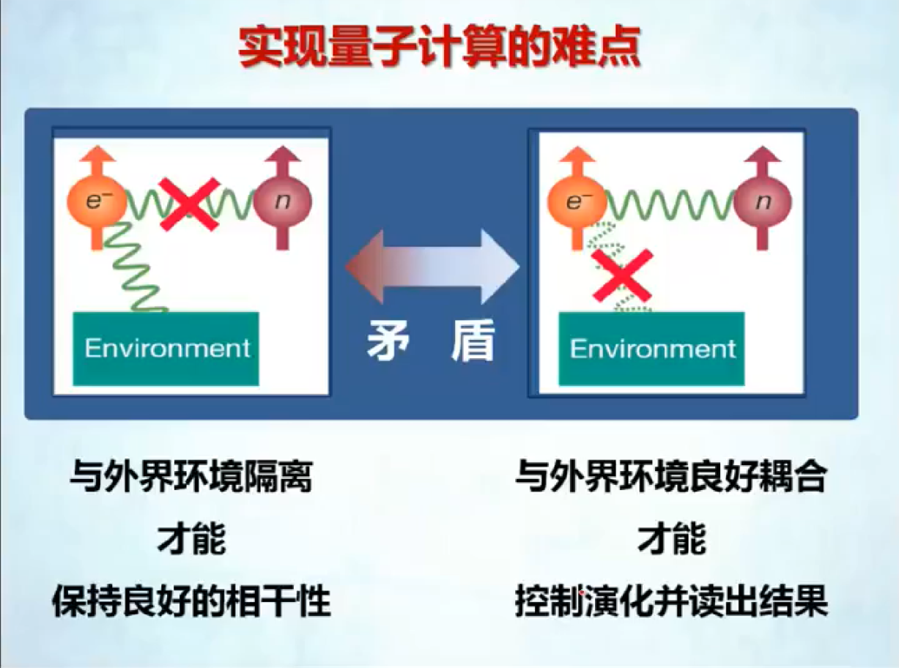

# Week2

### 历史上的计算设备

差分机

制表机

第一台电子计算机：ENIAC

EDVAC是世界上第一台存储程序计算机，是所有现代计算机的原型和范本

### 从电子管到云计算

新型计算模式——云计算

### 未来的计算——从摩尔定律到量子计算机

过去计算机发展的规律：摩尔定律

摩尔定律下的苦难

- **散热**
- 晶体管大小限制
- 电泄露

#### 量子计算机的基本原理

经典计算：

- 一个比特某一时刻只能保持一种状态（e.g. 0/1）
- n比特存储$2^n$个数中的一个
- 接受一个输入数据，完成一次运算，输出一个结果

量子计算：

- 一个量子比特可以同时保持多种状态
- n比特同时存储$2^n$个数
- 同时接受$2^n$个输入数据，同时完成$2^n$次运算，输出$2^n$个结果

