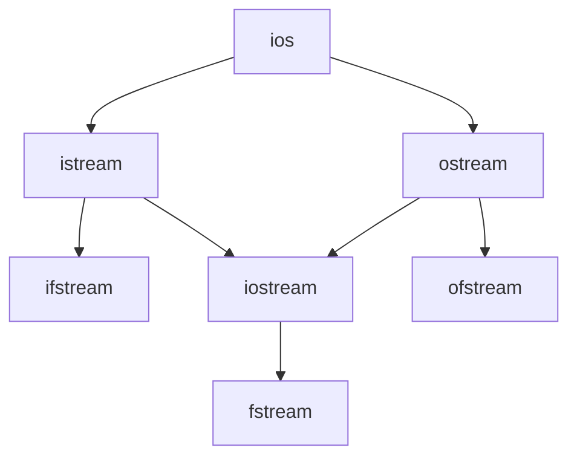

## 输入和输出

### 与输入输出流操作相关的类

- `istream`是用于输入的流类，`cin`就是该类的对象。 
- `ostream`是用于输出的流类，`cout`就是该类的对象。 
- `ifstream`是用于从文件读取数据的类。 
- `ofstream`是用于向文件写入数据的类。 
- `iostream`是既能用于输入，又能用于输出的类。 
- `fstream `是既能从文件读取数据，又能向文件写入数据的类。 

这些类的派生关系可以用下图来表达：



### 标准流对象

 输入流对象: 

- `cin`与标准输入设备相连

输出流对象：

- `cout`与标准输出设备相连
- `cerr`与标准错误输出设备相连
- `clog`与标准错误输出设备相连 

Tipps: Why we need cerr?

通过重定向，使得`cout`和`cerr`面向不同的地方输出数据，这就能达调试信息和程序真正应该输出的结果分开输出的目的。

`cin`对应于标准输入流，用于从键盘读取数据，也可以被**重定向** 为从文件中读取数据。

`cout` 对应于标准输出流，用于向屏幕输出数据，也可以被**重定向**为向文件写入数据。

`cerr` 对应于标准错误输出流，用于向屏幕输出出错信息

`clog` 对应于标准错误输出流，用于向屏幕输出出错信息

> `cerr`和`clog`的区别在于`cerr`不使用缓冲区,直接向显示器输出信 息；而输出到`clog`中的信息先会被存放在缓冲区,缓冲区满或者 刷新时才输出到屏幕。 

### 重定向

输出重定向

```cpp
#indlude<iostream>
using namespace std;
int main(){
	int x,y;
	cin>>x>>y;
	freopen("test.txt","w",stdout);
	//stdout默认为在屏幕上打印
	//将标准输出重定向到test.txt文件，w代表写
	if(y==0) //在屏幕上输出错误信息
		cerr<<"error."<<endl;
	else
		cout<<x/y;
	return 0;
}
```

输入重定向

```cpp
freopen("in.txt", "r", stdin);
//cin被改为从in.txt文件里读取数据
//r代表read 读入
```

### 判断输入流结束

```cpp
while (cin >> x)
{
	...
}
//第二种方法：
if (!cin.getline())
//注意：getline()读到留在流中的\n就会返回
```
- 如果从文件输入，那么读到文件尾部就算结束；
- 如果时键盘输入，则在单独一行输入`ctrl+z`代表输入结束
`cin` 作为条件判断语句其实时做了一个强制类型转换！没有读到输入时返回`false`

### `istream`类的成员函数

```cpp
istream & getline(char * buf, int bufSize); 
```

从输入流中读取 `bufSize-1` 个字符到缓冲区 `buf`，或读到碰到 `\n` 为止（哪个先到算哪个）。

```cpp
istream & getline(char * buf, int bufSize,char delim);
```

从输入流中读取 `bufSize-1` 个字符到缓冲区 `buf`，或读到碰到 `delim` 字符为止（哪个先到算哪个）。 

两个函数都会自动在 `buf` 中读入数据的结尾添加 `\0`。`\n` 或 `delim` 都不会被读入 `buf`，但**会被从输入流中取走,即删掉**。如果输入流中 `\n` 或 `delim` 之前的字符个数达到或超过了 `bufSize` 个，就导致读入出错，其结果就是：虽然本次读入已经完成，但会影响之后的操作，即是之后的读入就都会失败了。 

- `bool eof()`：判断输入流是否结束 
- `int peek()`：返回下一个字符,但不从流中去掉。使用场景：根据下一个字符的类型决定操作，同时不影响字符串的完整性。 
- `istream& putback(char c);`：将字符 `ch` 放回输入流
- `istream& ignore(int nCount = 1, int delim = EOF);`：从流中删掉最多 `nCount` 个字符，遇到 `EOF` 时结束。 

## Reference
- [1] https://www.coursera.org/learn/cpp-chengxu-sheji/
- [2] https://github.com/chiuchiuuu/programming-and-algorithm